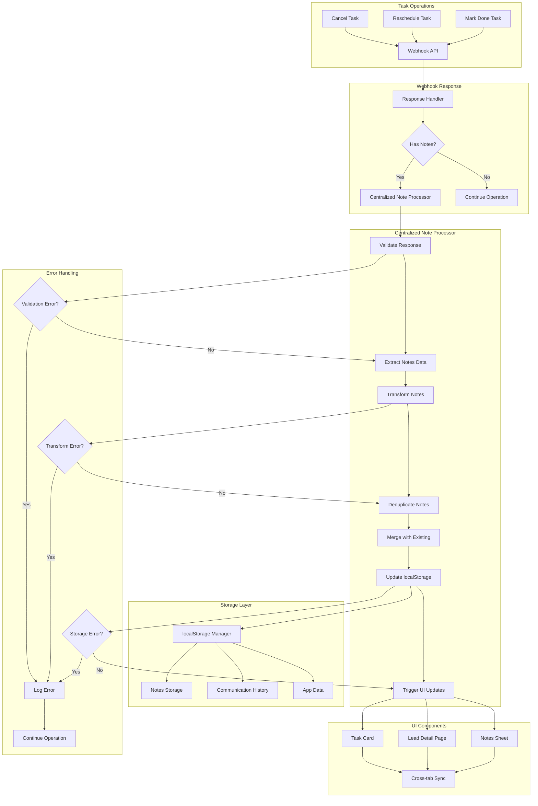
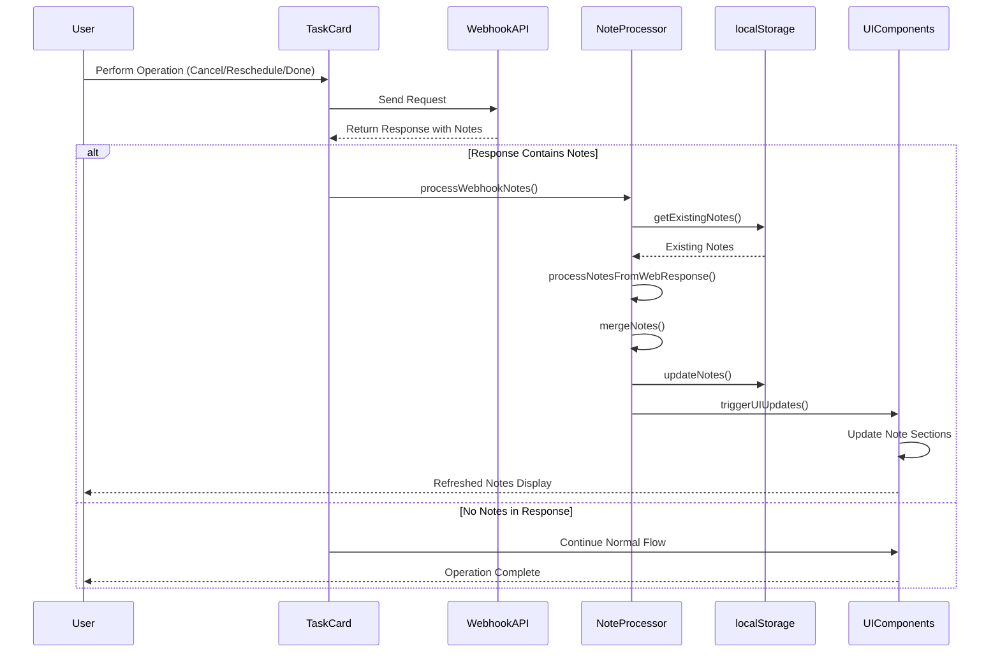
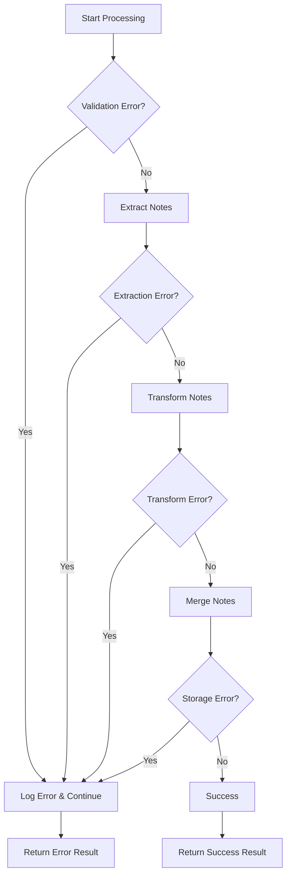
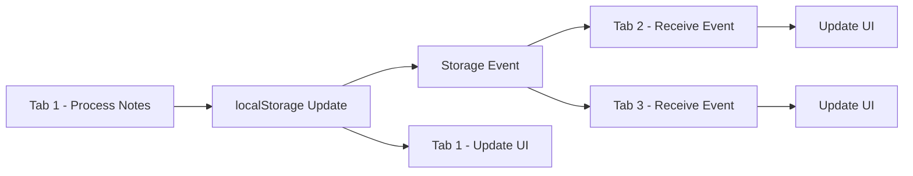

# Webhook Note Processing Architecture

## System Architecture Diagram



## Data Flow Diagram



## Component Interaction Diagram

```mermaid
graph LR
    subgraph "New Components"
        A[webhook-note-processor.ts]
        B[Enhanced note-transformer.ts]
    end
    
    subgraph "Existing Components"
        C[task-card.tsx]
        D[leads/[id]/page.tsx]
        E[localStorage-manager.ts]
        F[storage-event-throttle.ts]
    end
    
    A --> B
    A --> E
    A --> F
    C --> A
    D --> A
    
    B --> E
    E --> G[localStorage]
    F --> H[Cross-tab Events]
```

## Implementation Details

### 1. Webhook Note Processor Interface

```typescript
interface WebhookNoteProcessorOptions {
  leadId: string;
  operationType: 'cancel_task' | 'reschedule_task' | 'mark_done';
  responseData: any;
  operationContext?: {
    taskId?: string;
    note?: string;
    nextFollowUpDate?: Date;
    agentName?: string;
  };
}

interface WebhookNoteProcessorResult {
  success: boolean;
  notesProcessed: number;
  errors: string[];
  uiUpdateRequired: boolean;
}
```

### 2. Processing Flow Steps

1. **Validation Phase**
   - Check response structure
   - Validate note data format
   - Verify required fields present

2. **Extraction Phase**
   - Extract `current_note` if present
   - Extract `notes` array if present
   - Parse note metadata

3. **Transformation Phase**
   - Convert webhook format to storage format
   - Normalize timestamps
   - Handle missing fields gracefully

4. **Deduplication Phase**
   - Check against existing notes
   - Remove duplicates within response
   - Preserve note order

5. **Merge Phase**
   - Combine new notes with existing
   - Maintain chronological order
   - Update storage atomically

6. **UI Update Phase**
   - Trigger storage events
   - Update relevant components
   - Synchronize across tabs

### 3. Error Handling Strategy



### 4. Performance Considerations

- **Lazy Loading**: Import processor only when needed
- **Batch Operations**: Process all notes in single transaction
- **Event Throttling**: Prevent excessive storage events
- **Memory Management**: Clean up temporary data

### 5. Cross-Tab Synchronization



## Integration Points

### 1. Task Card Integration

```typescript
// In handleCancel function
const noteProcessingResult = await handleWebhookNoteProcessing({
  leadId: task.leadId,
  operationType: 'cancel_task',
  responseData: responseData,
  operationContext: {
    taskId: task.id,
    note: note,
    agentName: agentName
  }
});
```

### 2. Lead Page Integration

```typescript
// In handleSaveNote function
const noteProcessingResult = await handleWebhookNoteProcessing({
  leadId: lead.lead_id,
  operationType: 'mark_done',
  responseData: result,
  operationContext: {
    agentName: agentName
  }
});
```

### 3. Storage Integration

```typescript
// Centralized storage update
localStorageManager.updateNotes(leadId, mergedNotes);

// Cross-tab synchronization
dispatchThrottledStorageEvent('app_data', JSON.stringify(appData));
```

## Testing Strategy

### 1. Unit Tests

- Test processor with valid response
- Test processor with invalid response
- Test processor with missing notes
- Test processor with duplicate notes
- Test error handling scenarios

### 2. Integration Tests

- Test cancel operation with notes
- Test reschedule operation with notes
- Test mark_done operation with notes
- Test cross-tab synchronization
- Test UI update triggers

### 3. End-to-End Tests

- Complete user workflow testing
- Performance testing
- Error recovery testing
- Browser compatibility testing

## Monitoring and Debugging

### 1. Logging Strategy

```typescript
console.log(`📝 [${operationType.toUpperCase()}] Processing webhook notes for lead ${leadId}`);
console.log(`✅ [${operationType.toUpperCase()}] Successfully processed ${processedCount} notes`);
console.error(`❌ [${operationType.toUpperCase()}] Error processing webhook notes:`, error);
```

### 2. Error Tracking

- Track processing failures
- Monitor UI update issues
- Log cross-tab sync problems
- Measure performance metrics

### 3. Success Metrics

- Notes processed successfully
- UI updates triggered
- Cross-tab sync completed
- User actions completed

## Deployment Considerations

### 1. Feature Flags

```typescript
const ENABLE_CENTRALIZED_NOTE_PROCESSING = process.env.NEXT_PUBLIC_CENTRALIZED_NOTES === 'true';

if (ENABLE_CENTRALIZED_NOTE_PROCESSING) {
  // Use new centralized processor
} else {
  // Fall back to existing implementation
}
```

### 2. Gradual Rollout

- Test with small user group first
- Monitor for issues
- Gradually increase rollout
- Full deployment after validation

### 3. Rollback Plan

- Keep existing code as fallback
- Monitor for critical issues
- Quick rollback capability
- User notification system

## Future Enhancements

### 1. Real-time Updates

- WebSocket integration for live updates
- Push notifications for note changes
- Real-time collaboration features

### 2. Advanced Features

- Note categorization
- Note search functionality
- Note analytics and insights
- Note templates and shortcuts

### 3. Performance Optimizations

- Caching strategies
- Lazy loading techniques
- Background processing
- Memory optimization